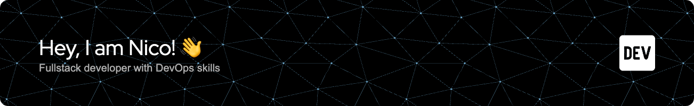

I'm a passionate web developer who loves building responsive and dynamic web applications.
Whether it's crafting sleek frontends with Angular or Vue.js, or powering complex backends with Node.js, I enjoy turning ideas into working code.

### Projects 💻

This section covers personal projects I've worked on in my free time, independent of my full-time role as an employed engineer.

- **[Pantrist 🛒](https://github.com/Pantrist-dev)**: A pantry and shopping list app built with Ionic, Capacitor, and Angular. It features real-time data syncing with Firebase and uses PostgreSQL for more complex queries like recipes. The app integrates with microservices implemented in Express or NestJS.
- **Reparo 🛠️**: An order management tool and app for a local roofer, offering full offline support to complete orders at the client's location without internet. It includes a PWA and an iOS application built with Ionic, Capacitor, and Angular. The backend is powered by a NestJS API using TypeORM & PostgreSQL.
- **Microk8s Cluster 🤖**: A fully self-hosted Kubernetes cluster with automated CI/CD pipelines, leveraging GitHub Actions and Helm for all my personal projects and microservices.

### My Skills 🧠
|   |   |
|---|---|
| **Languages**  |      |
| **Frontend**   |   |
| **Backend**    |     |
| **Databases**  |   |
| **DevOps**     |    |
| **Mobile**     |   |

---------

